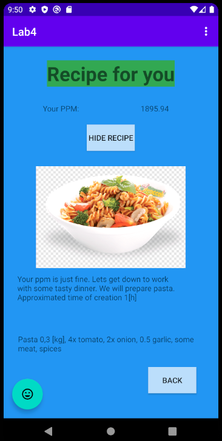

# Folder:"./BMI"

### Lab 1.
* 1) Create basic BMI calculator
* 2) return result (number- index)
* 3) make sure to tell if user is fat or not!

# Folder:"./PPM"

### Lab 2. Create app with:
* 1) Main menu
* 2) BMI calc
* 3) BWR calc (Harris-Benedict)
* 4) Example Recipe (what to eat based on BWR result)
* Make sure create several views and simply go back and forth for training.

### Lab 3. Add to existing app from lab 2 (04.04.2020):
* 1) Quiz game (OR)
* 2) Any game (OR)
* 3) Chart display

# Folder:"./KOTLIN"

### Lab 4. Revrite 50% of your functionality to Kotlin (25.04.2020):
* 1) Main menu -OK
* 2) BMI calc -OK
* 3) BWR calc -OK
* 4) Example Recipe -OK 
* 5) Quiz game -NOT OK
* 6) Chart -OK
----- (circa 70%) -----

# PPM project overwiev
## APP PLAN:

## APP MAIN:

## APP BMI:

## APP PPM:

## APP RECIPE:

## APP QUIZ:

## APP QUIZ SUMMARY:

## APP MAIN UPDATED:

## APP CHART:

# KOTLIN project overwiev
## APP PLAN:

## APP MAIN:

## APP BMI:

## APP PPM:

## APP RECIPE:

## APP GRAPH:

